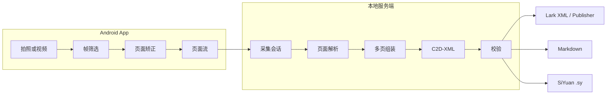

# Capture2Doc 总体方案

> 状态：设计与原型验证阶段  
> 决策日期：2026-09-03

## 目标

Capture2Doc 面向手机拍摄的文档图片。Android App 从拍照或视频中产生经过筛选和矫正的页面图片流，本地服务端恢复页面内容和跨页结构，过滤拍摄环境中的无关物体，并输出符合固定 Schema 的 C2D-XML。经过校验的 C2D-XML 由确定性输出层转换为 Lark 文档、Markdown 或思源笔记 `.sy`。

首个版本重点支持：

- 中文及中英混排的印刷文档；
- Android 拍照与视频扫描两种采集方式；
- 同一采集会话中增量提交多张页面图片；
- 标题、段落、列表、表格和公式等常见文档元素；
- 页面顺序、跨页段落和跨页表格的恢复；
- 桌面、键盘、手指、阴影和页面外背景的过滤；
- C2D-XML 语法、XSD 和业务规则校验；

C2D-XML 的边界从最终文档出发：它不复刻原始分页，不保存页面坐标，也不提供到采集来源的追溯。页面、坐标和采集来源如解析、质量诊断或重试所需，只保留在服务端内部中间结果中。

C2D-XML v0.1 标签体系已经冻结，XSD 和更新包/完整文档校验器已实现，三个目标 Renderer 尚待实现。本阶段不把手写文档、复杂图表语义恢复、图片输出或任意视觉问答列为首个版本的承诺能力。

## 系统边界

Capture2Doc 由两个可独立演进的产品组件组成：

- **Capture2Doc Android**：负责媒体采集、轻量质量判断、页面候选生成和人工确认，不运行核心 OCR/VLM。
- **Capture2Doc Server**：运行在用户自己的 Mac 或带消费级显卡的主机上，负责接收页面流、调用本地模型、生成 C2D-XML 和导出文件。

“仅支持本地推理”是首个版本的硬约束：服务端不得把图片、OCR 文本或提示词发送给第三方模型 API。Android 与服务端可以通过用户局域网通信。Lark 文档在线发布属于可选输出连接器，必须由用户显式配置和触发，不属于模型推理链路。

## 总体架构



## 端到端处理流程

```text
Android 拍照或视频
    │
    ▼
帧筛选、文档检测、裁边、旋转、透视校正与去重
    │
    ▼
按采集会话增量上传页面图片
    │
    ▼
页面级解析
文字 / 表格 / 公式 / 坐标 / 阅读顺序
    │
    ▼
多页编排与语义映射
页面排序 / 跨页合并 / 去页眉页脚 / 过滤背景 / C2D-XML 映射
    │
    ▼
C2D-XML 页面无关的逻辑文档
    │
    ▼
XML 解析校验 → XSD 校验 → 业务规则校验
    │
    ├── Lark Renderer / Publisher
    ├── Markdown Renderer
    └── SiYuan Renderer
```

系统采用两阶段模型，而不是要求单个 VLM 同时完成高分辨率 OCR、跨页理解和严格格式输出。页面解析器负责视觉内容忠实度，通用 VLM 负责多图关联和 C2D 文档结构映射。

服务端可以在图片到达后增量完成页面解析，但必须等客户端结束采集会话后，才能执行最终页面排序、跨页组装、XML 校验和导出。

文档组装计划采用小窗口增量生成：每轮提供最近至多三个顶层 block，
模型始终回传最后一个 block 的完整修订版并追加新 block，较早上下文只读。
这也可以在 finalize 固定输入顺序后执行，并不要求在上传阶段修改正式文档。
每轮响应使用内部 c2d-update 信封，独立校验完整子树；最终 document 再做整文档校验。
当前已实现校验、尾块替换、768/1536 token 上下文选择及离线文件导出。
上下文实际返回数量由尾块长度和调用方提供的剩余预算决定，详见
[C2D-XML 增量组装](c2d_xml_assembly.md)。真实模型窗口调度和端到端采集流程尚未接入。

## Android App

### 拍照模式

拍照完成后立即检测文档四边形，执行旋转和透视校正，并展示预览供用户调整裁边、旋转和页面顺序。只有用户接受的页面才进入上传队列。

### 视频模式

视频只作为页面发现和取帧来源，首个版本不把整段视频上传到服务端。Android 端持续执行：

1. 文档区域检测与稳定性判断；
2. 清晰度、眩光、遮挡和完整性评分；
3. 从稳定区间选取质量最高的关键帧；
4. 页面透视校正和重复页面过滤；
5. 将新页面候选加入采集会话。

用户结束扫描前可以删除、重拍或调整页面顺序。上传完成不代表文档完成；客户端必须单独发送 `finalize` 信号。

### 页面上传契约

“图片流”在首个版本中定义为一系列可重试、可恢复的页面上传，而不是一个不可恢复的长连接视频流。每个页面至少携带：

- `session_id`、`page_index` 和稳定的 `capture_id`；
- `source_mode`（`photo` 或 `video`）和采集时间；
- MIME 类型、宽高、字节数和 SHA-256；
- 原图中的文档四边形、旋转角度和已经应用的变换；
- 清晰度、眩光、遮挡和完整性等质量信号。

服务端以 `capture_id` 和 SHA-256 保证幂等与去重，不信任客户端给出的页面内容结论，但保留其质量及几何信息用于复核。

## 本地服务端

### 会话接口

首个版本采用简单的 HTTP 会话接口，避免把 Android 客户端绑定到特定模型或推理框架：

```text
POST /v1/sessions
PUT  /v1/sessions/{session_id}/pages/{page_index}
POST /v1/sessions/{session_id}/finalize
GET  /v1/jobs/{job_id}
GET  /v1/documents/{document_id}
POST /v1/documents/{document_id}/exports
GET  /v1/artifacts/{artifact_id}
```

页面上传接口使用幂等 PUT。首个版本通过轮询获取任务状态，后续可以增加 Server-Sent Events，而不改变任务模型。

会话状态固定为：

```text
OPEN → RECEIVING → FINALIZED → PARSING → ASSEMBLING → VALIDATING → READY
                                                                  └→ FAILED
```

`finalize` 后不再接受新页面；需要补拍时创建新修订或新会话，避免解析期间输入集合变化。

### 服务端组件

1. **Session API**：验证请求、鉴权、幂等、页序和会话状态。
2. **Local Asset Store**：保存原始页面、处理后页面、模型中间结果和导出物。
3. **Quality Gate**：复核分辨率、方向、模糊、页面边界和重复页面。
4. **Page Parser**：逐页产生文字、表格、公式、布局、坐标和阅读顺序。
5. **Document Assembler**：完成页面排序、跨页合并、去页眉页脚、背景过滤和 C2D-XML 映射。
6. **C2D-XML Validator**：执行 XML、XSD 和业务规则校验。
7. **Renderer Registry**：从同一份通过校验的 C2D-XML 生成不同目标格式。
8. **Job Manager**：控制模型生命周期、资源队列、进度和可恢复错误。

本地元数据可使用 SQLite，图片和导出物使用按会话隔离的文件目录。存储实现不进入公共 API，后续可替换。默认仅允许一个模型推理任务占用加速设备，CPU 图像预处理和已完成文档的渲染可以并行。

## 模型处理层

### 服务端质量复核

Android 已完成主要裁边和透视校正，服务端仍需复核方向、页面完整性和输入质量。服务端不得对原图执行不可追溯的覆盖操作；原始上传和规范化页面必须分别保存，以便审计和疑难区域复核。

该层还应给出页面候选及质量信号，例如模糊、眩光、裁切不完整和分辨率不足。首个版本不依赖这些信号自动拒绝请求，但需保留扩展位置。这些诊断信息属于处理管线，不写入最终 C2D-XML。

### 页面解析器

已决定以 **PaddleOCR-VL-1.6** 作为主页面解析器，提取文字、表格、公式、块类别、坐标和阅读顺序。使用完整 pipeline，而不是只加载其中的 0.9B VLM 组件。

候选替换项：

- **MonkeyOCRv2-B-Parsing**：用于多语言或低质量实拍文档的对照。
- **Unlimited-OCR**：用于多页干净扫描件或数字 PDF 的一次性连续转写实验。
- **Qwen3-VL-8B**：作为无需专用页面解析器的单模型对照。

页面解析输出必须先标准化为内部块记录，不能把某个模型的 Markdown 或特殊 token 直接作为长期公共接口。

### 多页编排器

多页编排器统一采用量化后的 **Qwen3.5**：`cuda-16g` 默认使用 9B FP8，`apple-16g` 默认使用 4B 4-bit。两个档位共享相同输入输出契约。编排器接收：

- 所有页面的标准化解析结果；
- 标注页码的低分辨率页面缩略图；
- 对低置信度、冲突或关键字段区域的高分辨率裁剪；
- C2D-XML v0.1 Schema 及标签规则。

编排器负责页面排序、跨页结构、重复页眉页脚处理、无关内容过滤和 XML 字段映射。它不应无条件重写页面解析器已经可靠识别的原文。

让编排器看到页面缩略图和疑难区域，可以保留多图视觉推理能力，同时避免把每一页都以最高分辨率编码为视觉 token。

## C2D-XML 中间文档

服务端对外的唯一规范中间格式是 **C2D-XML**。它描述已经完成排序、跨页合并和清理的逻辑文档，而不是输入图片或原始页面的数字副本。页面解析器原生输出、页序、坐标和采集信息只作为内部中间结果，不能被输出 Renderer 直接消费，也不进入 C2D-XML。

C2D-XML 没有“原始页面”概念，Lark、Markdown 和思源输出都不尝试复刻拍摄材料的页边界。

C2D-XML v0.1 已冻结以下文档外壳：

- `<document>` 是唯一根节点，命名空间为 `urn:capture2doc:c2d:1`，`schema-version="0.1"` 必填；
- `<title>` 最多出现一次，如存在必须位于其他内容节点之前；
- 根节点的内容子节点按出现顺序组成最终阅读顺序；
- 不设置 `metadata`、`content`、`pages`、`sources` 或 `evidence` 包装节点。

核心块包括标题、段落、六级标题、列表、引用、表格、代码块和分隔线；行内能力包括粗体、斜体、下划线、删除线、代码、链接、换行、七色文字/背景和行内 LaTeX。表格保留 `rowspan` 与 `colspan`，但不保留列宽、单元格颜色或对齐等视觉属性。

C2D-XML v0.1 明确排除图片、画板、分栏、Callout、书签、飞书资源块、平台交互组件、任意 CSS、任意颜色以及 `align`。无法确认的内容不得由模型猜测，相关问题记录在任务诊断中，而不是扩展 C2D-XML。

XML 是否闭合应通过受约束生成和校验器保证；模型选型主要比较内容、标签、属性和树结构是否正确，而不是把 XML 语法能力当作核心智能指标。

完整标签与映射规则见 [C2D-XML 标签体系](c2d_xml.md)。

## 输出适配器

- **Lark**：首要输出目标。Renderer 移除 C2D `<document>` 外壳和命名空间，将标签转换为 Lark XML；Publisher 仅在用户授权后创建或更新在线文档。
- **Markdown**：通用回退格式。标题、列表、引用、代码、公式和链接转换为 Markdown；颜色、下划线与合并单元格按规范使用受限 HTML。
- **思源 `.sy`**：专用 Renderer 生成思源节点树、节点 ID 和文档属性；这些目标格式字段不进入 C2D-XML。

Renderer 必须是确定性转换，不调用 VLM。在线 Publisher 与本地推理解耦：未配置 Lark 凭证时，文档解析和其他导出仍可完整运行。

## 失败处理

- XML 无法解析或未通过 XSD 时，不进入输出适配器；允许按固定次数执行格式修复，但不得在修复阶段引入新事实。
- 页面模糊、反光或裁切不完整时，返回可定位的质量问题和建议重拍页面。
- OCR 与视觉复核冲突时，保留两者结果及来源，由规则或人工确认，不静默覆盖。
- 跨页关系无法确定时，不强行合并逻辑块；按可确定的阅读顺序输出，并在任务诊断中报告组装警告。原始页边界不进入 C2D-XML。
- 任何无法从输入确认的内容都不得写入 C2D-XML；相关不确定性写入任务诊断，凭空生成的值在验收指标中计为幻觉。

## 本地部署档位

服务端不提供云端推理回退。首个版本定义两个具有相同 API 和 C2D-XML 的部署档位：

| 档位 | 页面解析器 | 多页编排器 | 初始运行策略 |
|---|---|---|---|
| `cuda-16g` | PaddleOCR-VL-1.6 完整 pipeline | Qwen3.5-9B FP8 | Linux/WSL，顺序加载或严格限制显存常驻 |
| `apple-16g` | PaddleOCR-VL-1.6，Apple Silicon 支持路径 | Qwen3.5-4B 4-bit | MLX 优先，单任务、顺序推理 |

PaddleOCR-VL 官方目前提供 Apple Silicon 使用路径，其中 VLM 可以使用 MLX-VLM；官方已在 Apple M4 上完成精度验证，其他 Apple Silicon 机型仍需项目实测。参考[PaddleOCR-VL Apple Silicon 指南](https://github.com/PaddlePaddle/PaddleOCR/blob/main/docs/version3.x/pipeline_usage/PaddleOCR-VL-Apple-Silicon.md)。

初始部署遵循以下原则：

- NVIDIA 16GB 使用 Qwen3.5-9B FP8，并从 16K 上下文开始验证；
- Apple Silicon 16GB 默认使用 Qwen3.5-4B 4-bit；9B 仅作为可选实验，不作为最低配置承诺；
- 页面解析器和编排器优先顺序执行，避免两个服务同时预占大部分显存；
- 对多页输入限制单次高分辨率视觉 token，使用缩略图加疑难裁剪；
- 显存评估包含模型权重、视觉编码器、KV Cache、CUDA Graph 和推理框架开销；
- 所有性能数据必须来自实际量化权重和最终推理框架，不能直接套用全精度成绩；
- Qwen3.8-27B 可以通过激进量化或 CPU offload 做质量上限实验，但不作为当前生产基线。

两个档位都以单个活动推理任务为默认并发上限。服务器可以在接收期间增量解析页面，但进入多页组装前应释放不再需要的页面解析模型资源。内存不足时必须返回资源错误，不能静默切换到外部 API。

## 后续设计事项

下一阶段需要完成：

1. 将已有校验、尾块合并、上下文选择与离线序列化接入真实模型窗口调度；
2. Android 页面质量指标、页面上传上限和配对鉴权方式；
3. 页面解析器统一输出接口；
4. XML 生成约束、修复次数和错误返回结构；
5. Lark、Markdown 与思源 `.sy` Renderer 及逐标签映射测试；
6. 自建数据集、验收阈值和人工复核流程；
7. Apple Silicon 16GB 支持的最低芯片代际和性能目标。

模型选择和公开证据见[模型选型记录](model-selection.md)。
