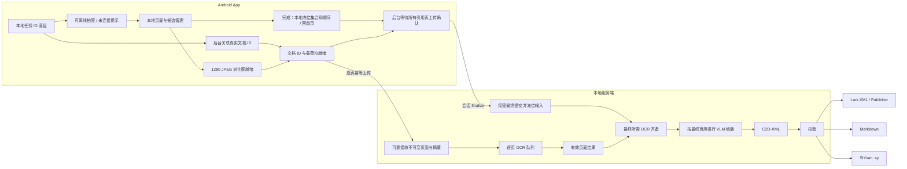

# Capture2Doc 总体方案

> 2026-09-05 任务首页修订：有效方案以 [Android 任务首页与采集任务](android_task_home.md) 为准。业务页蓝白、相机蓝黑；多个草稿、允许离线新建并提示未连接，上传前关联文档 ID；上传 1280 派生图；移除重拍；完成直接回任务列表并后台上传；列表删除仅本机隐藏，不中止工作。正文按当前流程维护；单草稿、整理网格和重拍的旧理由集中保留在开发总览的历史演变中。2026-09-05 用户确认当前离线版本真机人工测试通过；新版设备自动化和跨端联调分别验收。

> 状态：设计与原型验证阶段  
> 流程核对日期：2026-09-05；实现基线：`e55c8f8`

本文描述目标架构，不表示所有组件均已实现。跨端触发条件、编辑与失败案例统一见 [扫描 Pipeline](capture_pipeline.md)；本轮实现和设计演变见 [开发成果与计划](android_progress_and_plan.md)。当前 Android 已实现任务首页、多草稿及 HTTP/WorkManager 客户端；服务端本地 CLI 已连接 Paddle → Qwen 串行推理、完整提示词、真实 token 预算、XML 组装与原子检查点恢复。上游记录单张真实照片 GPU 闭环、完成后恢复及 SIGTERM 中断续跑通过；多图、内容/样式质量仍待扩展，不能等同于 Android HTTP 联通。详见 [服务端 Pipeline](server_pipeline.md)。 业务 HTTP API 与 Android 端到端链路尚未接通。

## 目标

Capture2Doc 面向手机拍摄的文档图片。Android App 从拍照或视频中产生经过筛选和矫正的页面图片流，本地服务端恢复页面内容和跨页结构，过滤拍摄环境中的无关物体，并输出符合固定 Schema 的 C2D-XML。经过校验的 C2D-XML 由确定性输出层转换为 Lark 文档、Markdown 或思源笔记 `.sy`。

首个版本的目标能力（含尚未实现项）：

- 中文及中英混排的印刷文档；
- Android 拍照与视频扫描两种采集方式；
- 同一采集会话中增量提交多张页面图片；
- 标题、段落、列表、表格和公式等常见文档元素；
- 遵循用户最终确认页序，恢复跨页段落和跨页表格；
- 桌面、键盘、手指、阴影和页面外背景的过滤；
- C2D-XML 语法、XSD 和业务规则校验；

C2D-XML 的边界从最终文档出发：它不复刻原始分页，不保存页面坐标，也不提供到采集来源的追溯。页面、坐标和采集来源如解析、质量诊断或重试所需，只保留在服务端内部中间结果中。

C2D-XML v0.1 标签体系已经冻结，XSD 和更新包/完整文档校验器已实现，三个目标 Renderer 尚待实现。本阶段不把手写文档、复杂图表语义恢复、图片输出或任意视觉问答列为首个版本的承诺能力。

## 系统边界

Capture2Doc 由两个可独立演进的产品组件组成：

- **Capture2Doc Android**：负责媒体采集、轻量质量判断、页面候选生成和人工确认，不运行核心 OCR/VLM。
- **Capture2Doc Server**：运行在用户自己的 Mac 或带消费级显卡的主机上，负责接收页面流、调用本地模型、生成 C2D-XML 和导出文件。

“仅支持本地推理”是首个版本的硬约束：服务端不得把图片、OCR 文本或提示词发送给第三方模型 API。Android 与服务端可以通过用户局域网通信。Lark 文档在线发布属于可选输出连接器，必须由用户显式配置和触发，不属于模型推理链路。

## 总体架构

下图为目标联网架构。拍照只需走已配置的图像处理步骤；视频取帧、文档检测和透视矫正尚未实现，不是当前逐页上传必须等待的已就绪能力。



## 端到端处理流程

客户端本地采集与网络分支相互独立，用户完成可以早于首次上传。下表给出有效触发条件，不把上图多条输入边误解为任选其一：

| 阶段 | 必须先满足 | 后继动作 |
|---|---|---|
| 开始拍摄 | 本地 taskId 及页面仓库已落盘；不要求服务连接 | CameraX 原图保存、候选管理、后台派生图 |
| 逐页上传 | 已关联并保存真实 documentId，1280 JPEG 有效 | 幂等 PUT；服务端可靠接收后排 OCR |
| 用户完成 | 至少一页且保留页原图安全 | 冻结本地有序列表并立即回首页，可处于未连接 |
| 发送会话 finalize | 本地已有最终快照、真实 documentId、全部引用页上传确认 | 服务端接受并冻结最终输入 |
| VLM 组装 | 服务端最终提交已接受、引用 OCR 结果齐备 | 按用户页序组装、跨页合并、过滤和 XML 更新 |
| 输出 | XML 校验及序列化成功 | 由目标 Renderer 生成输出；不把 XML 字节等同于目标文件 |


系统采用两阶段模型，而不是要求单个 VLM 同时完成高分辨率 OCR、跨页理解和严格格式输出。页面解析器负责视觉内容忠实度，通用 VLM 负责多图关联和 C2D 文档结构映射。

目标服务端在成功接收每张页面后立即排入 OCR 队列，结果绑定不可变 pageId（拟映射 image_id）和上传摘要；入队不意味着 GPU 立即执行。用户无需等待 OCR 才继续编辑或决定结束采集。最终提交被接受后，服务端等待最终引用页面的有效结果齐备，才按确认顺序启动 VLM。删除或排序不要求重跑其余页面 OCR；重拍功能已移除，替换照片使用删除旧页、新增页面。

文档组装计划采用小窗口增量生成：每轮提供最近至多三个顶层 block，
模型始终回传最后一个 block 的完整修订版并追加新 block，较早上下文只读。
目标流程在会话级 finalize 冻结输入、所需 OCR 结果齐备后执行该组装，不在上传阶段按 OCR 回调顺序修改正式文档。
每轮响应使用内部 c2d-update 信封，独立校验完整子树；最终 document 再做整文档校验。
当前已实现校验、尾块替换、768/1536 token 上下文选择及离线文件导出。
上下文实际返回数量由尾块长度和调用方提供的剩余预算决定，详见
[C2D-XML 增量组装](c2d_xml_assembly.md)。本地 CLI 已接入真实模型窗口调度、允许真实预算内完整大尾块及恢复；单图 GPU 和 SIGTERM 验证见服务端专题，Android 采集上传仍未接通。

会话级 `finalize` 是未来业务协议；已有 `C2DAssembler.finalize()` 仅校验并序列化 XML，不冻结内存状态、不启动模型或写文件。页面上传的幂等语义也不适用于非幂等的 XML 更新应用。

## Android App

### 拍照模式

目标联网流程中，拍照页直接承担页面候选管理，不强制经过独立整理页。真实 documentId 关联且 1280 JPEG 派生图就绪后按不可变 pageId 幂等上传，成功接收后排入 OCR 队列。点击“完成”发起最终集合与顺序提交，并返回任务首页；服务端接受后冻结本次输入。界面区分等待上传/提交、OCR、VLM 组装、校验和导出，不预先宣称 VLM 正在运行。客户端使用 1280 JPEG，完成先回首页，后台等全部引用页确认后再提交。

当前 Android 有多任务存储、任务首页、HTTP 适配器和 WorkManager 调度；服务地址默认空时允许本地拍摄、保存和完成，持续提示未连接；真实文档 ID 取得前不上传。2026-09-05 用户确认当前离线版本真机人工测试通过，设备自动化和跨端专项仍需独立证据。客户端实现不代表 OCR 业务队列或完整文档服务已上线。

当前相机完成冻结页序并回首页；保存草稿可续拍，提交后只读。首页删除仅隐藏本机记录，不取消任务或清理后台所需图片。

### 视频模式

视频只作为页面发现和取帧来源，首个版本不把整段视频上传到服务端。Android 端持续执行：

1. 文档区域检测与稳定性判断；
2. 清晰度、眩光、遮挡和完整性评分；
3. 从稳定区间选取质量最高的关键帧；
4. 页面透视校正和重复页面过滤；
5. 将新页面候选加入采集会话。

用户结束扫描前可以删除或调整页面顺序，不再提供重拍。已经上传并完成 OCR 的页面仍只是一份可复用的页面结果；上传完成不代表文档完成。客户端必须单独发送带最终有序页面 ID 的 `finalize` 请求，服务端只组装该列表引用的页面。

### 页面上传契约（客户端提案）

当前 v1 提案集中维护于 [Android / Server 协议](android_task_protocol.md)：可先离线拍摄并提示未连接，上传前再取得 documentId，以 pageId 和 SHA-256 幂等上传长边不超过 1280 的 JPEG。首版不提交未实现的四边形、质量评分等元数据；同一页面 ID 不允许更换内容，没有重拍修订。

候选删除采用最终集合语义，已上传但未引用的页面不参与最终文档。首页移除整个任务仅本机隐藏，服务端继续处理；资产回收与配额仍待明确。

## 本地服务端

### 文档接口提案（客户端已实现，服务端待接入）

```text
POST /v1/documents
PUT  /v1/documents/{documentId}/pages/{pageId}
POST /v1/documents/{documentId}/finalize
GET  /v1/documents/{documentId}
```

上游曾提出 /images/{image_id}、jobs 和 exports 路由草案；Android 本轮实现的是上列 /pages/{pageId} 与 GET 文档快照提案。两者没有已部署 HTTP 可供直接兼容，联调需统一路由与字段。服务端只保留 document_id / 不可变 image_id / ordered_image_ids，不建立逻辑 page_id 或同 ID 修订。客户端完成先冻结 pageIds 并回首页，等引用页上传确认后发 finalize；服务端接受后等有效 OCR 齐备。创建与 finalize 使用稳定幂等键，PUT 确认页面 ID 和摘要。GET 返回文档/逐页 flag，COMPLETED 返回最终标题、字数与只读 plainText。

具体字段、错误和重试见协议专题；流式 block、鉴权及 Renderer 输出端点另行联调，不把旧示意 API 当作可调用接口。

下图仅表达业务阶段；不是已冻结枚举，也不是现有 Android 的页面状态机：

```text
OPEN → RECEIVING → FINALIZED → WAITING_FOR_PAGES → ASSEMBLING → VALIDATING → READY
          │              │                                                 └→ FAILED
          └─ 每页：QUEUED → PARSING → READY / FAILED
```

服务端接受最终提交后，本次冻结输入不再原地改变。只等待最终引用页面的有效 OCR；不能因已删除页失败而阻塞，也不能静默跳过必需失败页。冻结后补拍采用新修订还是新会话、如何复用有效结果和保留历史，仍待产品与协议设计。

### 目标服务端组件与现状

以下是职责划分。当前已有独立 Worker、XML 校验/组装、双模型串行 CLI 与检查点恢复；HTTP、实时业务队列、完整 Paddle 页面 pipeline 和 Renderer 尚未接入。CLI 的单图 GPU 与 SIGTERM 验证不覆盖多文档网络调度。

1. **Session API**：验证请求、鉴权、幂等、页序和会话状态。
2. **Local Asset Store**：保存原始页面、处理后页面、模型中间结果和导出物。
3. **Quality Gate**：复核分辨率、方向、模糊、页面边界和重复页面。
4. **Page Parser**：逐页产生文字、表格、公式、布局、坐标和阅读顺序。
5. **Document Assembler**：遵循最终确认页序，完成跨页合并、去页眉页脚、背景过滤和 C2D-XML 映射，不擅自重排采集页。
6. **C2D-XML Validator**：执行 XML、XSD 和业务规则校验。
7. **Renderer Registry**：从同一份通过校验的 C2D-XML 生成不同目标格式。
8. **Job Manager**：控制模型生命周期、资源队列、进度和可恢复错误。

本地元数据可使用 SQLite，图片和导出物使用按会话隔离的文件目录。存储实现不进入公共 API，后续可替换。默认仅允许一个模型推理任务占用加速设备，CPU 图像预处理和已完成文档的渲染可以并行。

## 模型处理层

### 服务端质量复核

Android 当前只完成原图保存、方向校正和通用 1280 像素派生图，文档检测、裁边和透视校正尚未实现。未来即使客户端加入这些处理，服务端仍需复核方向、页面完整性和输入质量。服务端收到的是 1280 JPEG 派生图，不是手机保存的 original.jpg；不得把派生图当高分辨率原图。服务端不得不可追溯地覆盖接收文件，接收文件与后续处理产物分别保存，以便审计和疑难区域复核。

该层还应给出页面候选及质量信号，例如模糊、眩光、裁切不完整和分辨率不足。首个版本不依赖这些信号自动拒绝请求，但需保留扩展位置。这些诊断信息属于处理管线，不写入最终 C2D-XML。

### 页面解析器

已决定以 **PaddleOCR-VL-1.6** 完整 pipeline 作为目标页面解析器，提取文字、表格、公式、块类别、坐标和页内阅读顺序。当前独立 Worker 仅以 `OCR:` 调用 VLM；布局检测和区域任务路由尚未接入，不能把单图冒烟等同于完整页面解析。

候选替换项：

- **MonkeyOCRv2-B-Parsing**：用于多语言或低质量实拍文档的对照。
- **Unlimited-OCR**：用于多页干净扫描件或数字 PDF 的一次性连续转写实验。
- **Qwen3-VL-8B**：作为无需专用页面解析器的单模型对照。

页面解析输出必须先标准化为内部块记录，不能把某个模型的 Markdown 或特殊 token 直接作为长期公共接口。

### 多页编排器

多页编排器统一采用量化后的 **Qwen3.5**：`cuda-16g` 默认使用 9B FP8，`apple-16g` 默认使用 4B 4-bit。两个档位共享相同输入输出契约。编排器接收：

- 最终引用页面按确认顺序提供的标准化解析结果；
- 标注页码的低分辨率页面缩略图；
- 对低置信度、冲突或关键字段区域的高分辨率裁剪；
- C2D-XML v0.1 Schema 及标签规则。

编排器遵循最终确认页序，负责跨页结构、重复页眉页脚处理、无关内容过滤和 XML 字段映射。它不应擅自重排采集页或无条件重写页面解析器已经可靠识别的原文。疑似错序的提示与人工处理方式另行设计。

让编排器看到页面缩略图和疑难区域，可以保留多图视觉推理能力，同时避免把每一页都以最高分辨率编码为视觉 token。

## C2D-XML 中间文档

服务端对外的唯一规范中间格式是 **C2D-XML**。它描述已经完成排序、跨页合并和清理的逻辑文档，而不是输入图片或原始页面的数字副本。页面解析器原生输出、页序、坐标和采集信息只作为内部中间结果，不能被输出 Renderer 直接消费，也不进入 C2D-XML。

C2D-XML 没有“原始页面”概念，Lark、Markdown 和思源输出都不尝试复刻拍摄材料的页边界。

C2D-XML v0.1 已冻结以下文档外壳：

- `<document>` 是唯一根节点，命名空间为 `urn:capture2doc:c2d:1`，`schema-version="0.1"` 必填；
- `<title>` 最多出现一次，如存在必须位于其他内容节点之前；
- 根节点的内容子节点按出现顺序组成最终阅读顺序；
- 不设置 `metadata`、`content`、`pages`、`sources` 或 `evidence` 包装节点。

核心块包括标题、段落、六级标题、列表、引用、表格、代码块和分隔线；行内能力包括粗体、斜体、下划线、删除线、代码、链接、换行、七色文字/背景和行内 LaTeX。表格保留 `rowspan` 与 `colspan`，但不保留列宽、单元格颜色或对齐等视觉属性。

C2D-XML v0.1 明确排除图片、画板、分栏、Callout、书签、飞书资源块、平台交互组件、任意 CSS、任意颜色以及 `align`。无法确认的内容不得由模型猜测，相关问题记录在任务诊断中，而不是扩展 C2D-XML。

XML 是否闭合应通过受约束生成和校验器保证；模型选型主要比较内容、标签、属性和树结构是否正确，而不是把 XML 语法能力当作核心智能指标。

完整标签与映射规则见 [C2D-XML 标签体系](c2d_xml.md)。

## 输出适配器

- **Lark**：首要输出目标。Renderer 移除 C2D `<document>` 外壳和命名空间，将标签转换为 Lark XML；Publisher 仅在用户授权后创建或更新在线文档。
- **Markdown**：通用回退格式。标题、列表、引用、代码、公式和链接转换为 Markdown；颜色、下划线与合并单元格按规范使用受限 HTML。
- **思源 `.sy`**：专用 Renderer 生成思源节点树、节点 ID 和文档属性；这些目标格式字段不进入 C2D-XML。

Renderer 必须是确定性转换，不调用 VLM。在线 Publisher 与本地推理解耦：未配置 Lark 凭证时，文档解析和其他导出仍可完整运行。

## 失败处理

- XML 无法解析或未通过 XSD 时，不进入输出适配器；允许按固定次数执行格式修复，但不得在修复阶段引入新事实。
- 页面模糊、反光或裁切不完整时，返回可定位的质量问题和建议重拍页面。
- OCR 与视觉复核冲突时，保留两者结果及来源，由规则或人工确认，不静默覆盖。
- 跨页关系无法确定时，不强行合并逻辑块；按可确定的阅读顺序输出，并在任务诊断中报告组装警告。原始页边界不进入 C2D-XML。
- 任何无法从输入确认的内容都不得写入 C2D-XML；相关不确定性写入任务诊断，凭空生成的值在验收指标中计为幻觉。

## 本地部署档位

服务端不提供云端推理回退。首个版本定义两个具有相同 API 和 C2D-XML 的部署档位：

| 档位 | 页面解析器 | 多页编排器 | 初始运行策略 |
|---|---|---|---|
| `cuda-16g` | PaddleOCR-VL-1.6 完整 pipeline | Qwen3.5-9B FP8 | Linux/WSL，顺序加载或严格限制显存常驻 |
| `apple-16g` | PaddleOCR-VL-1.6，Apple Silicon 支持路径 | Qwen3.5-4B 4-bit | MLX 优先，单任务、顺序推理 |

PaddleOCR-VL 官方目前提供 Apple Silicon 使用路径，其中 VLM 可以使用 MLX-VLM；官方已在 Apple M4 上完成精度验证，其他 Apple Silicon 机型仍需项目实测。参考[PaddleOCR-VL Apple Silicon 指南](https://github.com/PaddlePaddle/PaddleOCR/blob/main/docs/version3.x/pipeline_usage/PaddleOCR-VL-Apple-Silicon.md)。

初始部署遵循以下原则：

- NVIDIA 16GB 使用 Qwen3.5-9B FP8，并从 16K 上下文开始验证；
- Apple Silicon 16GB 默认使用 Qwen3.5-4B 4-bit；9B 仅作为可选实验，不作为最低配置承诺；
- 页面解析器和编排器优先顺序执行，避免两个服务同时预占大部分显存；
- 对多页输入限制单次高分辨率视觉 token，使用缩略图加疑难裁剪；
- 显存评估包含模型权重、视觉编码器、KV Cache、CUDA Graph 和推理框架开销；
- 所有性能数据必须来自实际量化权重和最终推理框架，不能直接套用全精度成绩；
- Qwen3.8-27B 可以通过激进量化或 CPU offload 做质量上限实验，但不作为当前生产基线。

两个档位都以单个活动推理任务为默认并发上限。服务器可以在接收期间增量解析页面，但进入多页组装前应释放不再需要的页面解析模型资源。内存不足时必须返回资源错误，不能静默切换到外部 API。

## 后续设计事项

下一阶段需要完成（跨端待定事项统一见 [Pipeline 待决策表](capture_pipeline.md#6-联调前必须完成的决策)）：

1. 将已有校验、尾块合并、上下文选择与离线序列化接入真实模型窗口调度；
2. 服务端评审并实现 Android v1 协议提案，补齐配对鉴权、资源授权、清理策略与跨进程联调；页面质量指标随实际能力引入；
3. 页面解析器统一输出接口；
4. XML 生成约束、修复次数和错误返回结构；
5. Lark、Markdown 与思源 `.sy` Renderer 及逐标签映射测试；
6. 自建数据集、验收阈值和人工复核流程；
7. Apple Silicon 16GB 支持的最低芯片代际和性能目标。

模型选择和公开证据见[模型选型记录](model-selection.md)。
