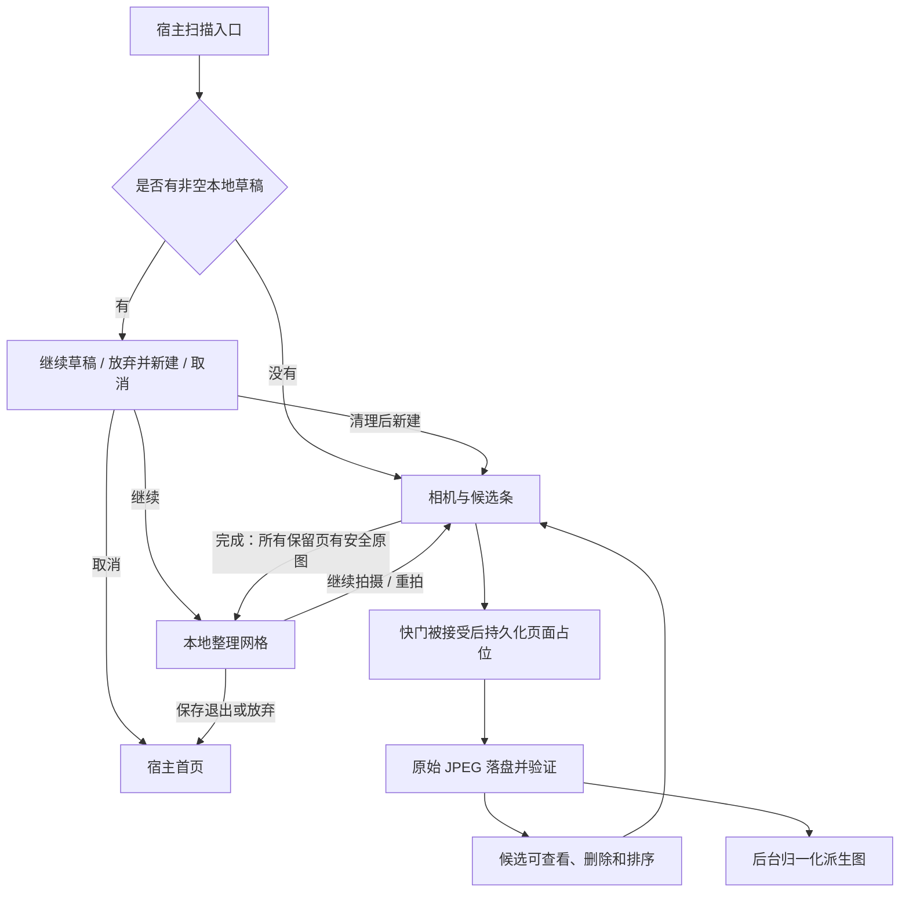
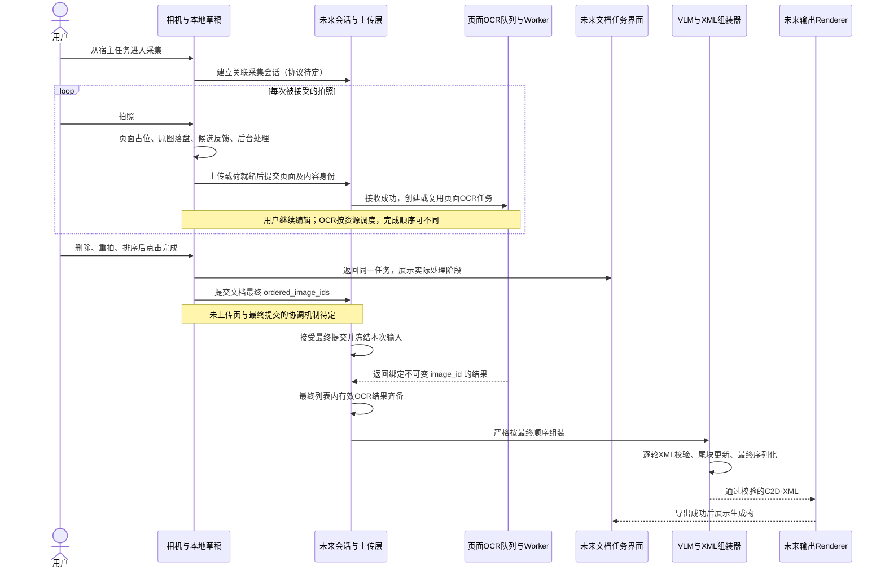

# 扫描 Pipeline：从拍照到逐页 OCR 与文档组装

> 状态：本地采集闭环已实现；跨端时序已决定但未实现，网络协议细节待讨论
> 核对日期：2026-09-05；实现基线：`e55c8f8`

本文是采集、上传、页面 OCR、最终确认与文档组装之间的流程依据。产品定位和模型部署见 [总体方案](architecture.md)，本轮成果、历史变更和下一步见 [开发成果与计划](android_progress_and_plan.md)。本次变更不修改公开 C2D-XML 标签体系。

## 1. 这次改变了什么

目标是让用户连续拍摄时就能管理候选页，并让已上传图片提前进入 OCR 队列。上传图片和确认整份文档是两个独立动作：用户可以继续删除、重拍和排序，最后才确定哪些图片及什么顺序参与正式文档。

2026-09-05 本轮进一步确定：服务端以 `document_id` 归属图片，只使用不可变 `image_id`，最终提交 `ordered_image_ids`。重拍创建新 image_id，服务端不再建立逻辑 page_id 或同 ID 内容修订。本文的“页面”仍可描述 Android 本地候选或纸面内容，不是新增服务端实体。新增 [本地 CLI](server_pipeline.md) 已连接模型调用与 XML 组装代码，真实 GPU 联调待执行；本页的上传/HTTP 与多文档实时调度仍属目标流程。

因此，目标联网流程不再强制“拍完 → 独立整理页 → 统一上传”。拍照页本身承担候选管理；点击“完成”发起最终提交并返回同一文档的任务/对话界面。当前代码仍保留独立整理页作为本地闭环，尚未执行网络操作，不能把目标导航当成已实现导航。

旧架构已经提出增量上传，但未充分区分“页面接受”“最终页序”和“服务端排序”的职责。本次将这些边界明确下来。完整历史对照见 [设计演变](android_progress_and_plan.md#设计演变与被替代的方案)。

## 2. 当前已经运行的本地流程

### 入口与页面持久化

- App 当前先显示临时宿主首页；进入扫描工具后，无草稿直接开相机。有草稿时选择“继续草稿”进入整理网格，“放弃并新建”清理后进入相机，取消留在宿主。
- 相机未就绪或未落盘队列已满时，点击不创建页面。只有被接受的快门才先写入稳定 `pageId` 和 `CAPTURING` 占位，再调用真实拍照能力。
- 页面按草稿数组顺序排列，新增页追加到末尾。占位、原图落盘、处理结果、删除、重拍和排序均自动保存，不等用户点击“完成”才创建持久草稿。
- 当前使用单个 `files/scan_draft` 专用目录、`AtomicFile` JSON 清单和 App 私有图片文件；没有 Room、DataStore 或 WorkManager。详情见 [扫描草稿与恢复](android_scan_draft.md)。

### 预览、保存与派生图是三个事件

| 事件 | 当前含义 | 不代表什么 |
|---|---|---|
| 候选占位/postview 可见 | 用户收到即时反馈；postview 只在当前进程存在 | 不保证原图已完整写入 |
| 原图安全落盘 | 原始 JPEG 已通过受限尺寸的真实像素解码检查 | 不保证派生图已生成，更不代表上传成功 |
| 派生图可用 | EXIF 已旋正，长边不超过 1280 像素的 JPEG 可用 | 不代表 OCR 已识别出文字 |

相机候选优先使用 postview，再回退到原图和派生图。postview 不是上传文件，也不是进程恢复依据。所谓“OCR 派生图”只是面向后续处理的图像产物；当前 Android 没有 OCR 请求。

相机“完成”要求至少一页，且所有保留页面均有安全原图。`NORMALIZING`、`FAILED + 安全原图` 可以进入整理页；`CAPTURING`、`RETAKE_REQUIRED`、原图缺失或损坏则阻止完成。后台派生图仍可继续生成。这是当前本地门槛，不是未来上传或会话提交的就绪判定。

### 编辑、返回与恢复

相机候选及其大图双击立即删除，无撤销；正在 `CAPTURING` 的页面不可删除。整理网格及其大图使用两步行内删除确认。两种入口的大图分别返回相机或网格；整理页存在待确认删除时，返回先取消确认，再按层级返回。

长按拖拽在松手后持久化。当前重拍入口在整理页：先协调旧任务，写入 `RETAKE_REQUIRED` 并立即尝试删除旧文件，然后进入相机，以原页面 ID 和原位置接收新照片。取消或中断保留占位。不能把重拍描述为“新照片成功后才删除旧照片”。

相机返回时，有页面或已接受拍摄则进入整理页，否则退出到宿主。整理页返回宿主前提供“保存并退出 / 放弃草稿 / 继续编辑”；直接点击整理页的保存按钮则保存退出。保存后的草稿可以重新打开编辑。最后一页删除后保留空态，禁用保存，退出或下次初始化清理空草稿。

旋转、切后台和进程重建以清单及已落盘文件恢复；有效原图可重建缺失派生图，无效原图保留失败占位，不重放真实快门。删除先移除清单引用，再删除目录，孤立目录后续清理。所有这些能力只覆盖本地文件和页面状态。

## 3. 目标联网流程与触发条件

以下是已决定但尚未接通的产品时序。会话、上传和 OCR 队列属于未来业务层；独立模型 Worker 已存在，不等于这条业务链路已经运行。

### 阶段职责与完成条件

| 阶段 | 触发条件 | 负责方和产物 | 后续动作 |
|---|---|---|---|
| 建立上下文 | 用户从宿主任务进入采集 | 宿主与会话层关联文档任务和采集会话 | 接受页面；离线建立/恢复策略待定 |
| 本地采集 | 快门被接受 | Android 保存页面身份、原图、候选及派生图 | 文件就绪后供上传使用 |
| 逐页上传 | 所选上传载荷有效可用 | 上传层可靠提交页面和对应内容身份 | 服务端成功接收后入 OCR 队列 |
| 图片 OCR | 图片已接收且未有可复用的有效结果 | 队列调度 Worker，结果绑定不可变 image_id | 保存结果，允许用户继续编辑其他候选 |
| 最终提交 | 用户决定完成本次文档 | 提交最终 ordered_image_ids；服务端接受后冻结 | 等待所引用图片的有效 OCR |
| 文档组装 | 最终输入已冻结且所需 OCR 全部有效 | VLM 按序恢复跨页结构，产生内部 XML 更新包 | 校验并应用更新 |
| XML 与输出 | 每轮更新和完整文档通过检查 | 已有组装器生成 XML；未来 Renderer 生成目标格式 | 返回同一宿主任务展示 |

“立即 OCR”在本文指成功接收后立即排队，不承诺无等待推理。用户拍摄第 2、3 页时，第 1 页可以已被解析；也可能由于资源占用仍在队列中。调度顺序不决定文档阅读顺序。

### 最终页序与三个“完成”

| 动作 | 当前/目标 | 实际职责 |
|---|---|---|
| 当前相机“完成” | 已实现 | 检查安全原图门槛，导航到本地整理页 |
| 未来相机“完成”与会话 `finalize` | 已决定但未实现 | 用户发起最终提交并回到任务界面；服务端接受提交后冻结输入 |
| `C2DAssembler.finalize()` | 已实现 | 校验内存文档并返回 UTF-8 XML 字节；不写文件、不冻结状态、不启动 OCR/VLM |

用户最终确认的页序是组装依据。VLM 负责该顺序下的跨页段落、列表、表格、层级恢复和背景过滤，不拥有重新排列采集页的权力。页序可疑时如何提示用户仍需后续设计，不能静默修改已确认顺序。

早期“不可变上传快照”的目的——避免组装期间输入变化——继续保留，冻结对象为最终有序 image_id 列表。图片可以早于最终确认上传。一个 image_id 只对应一份不可变图片；重复提交相同身份和相同字节可以复用，同 ID 不同内容应拒绝。Android 本地重拍仍复用 pageId，上传层必须为新图片另建 image_id。

任务界面根据真实阶段显示等待上传/提交、等待或执行 OCR、VLM 组装、校验、导出、完成或失败。这些是产品阶段描述，不是已实现的枚举。返回任务页不意味着 VLM 已启动；上传完成也不能显示为文档完成。

## 4. 交错操作示例

### A、B、C 的顺序与删除

1. 用户依次拍摄 A、B、C，本地初始顺序为 `[A, B, C]`，各页载荷就绪后分别上传。
2. 假设 OCR 结果按 B、A、C 返回；结果先按各自不可变 image_id 保存，不能直接按回调顺序追加为正式文档。
3. 用户删除 B，再把 C 移到 A 前面，最终列表成为 `[C, A]`。
4. 完成提交被接受后，仅等待 C、A 的有效结果；B 不进入文档，也不能因 B 的失败阻塞该文档。
5. VLM 按 C、A 处理。单纯排序不重跑这两页 OCR；已上传的 B 可成为远端孤立资产，取消任务与文件回收按后续策略执行。

### A 在 OCR 中被重拍

当前本地重拍保留 A 的 pageId 和数组位置，但删除旧图并保留待重拍占位。联网后，旧图、新图分别使用不同 image_id；旧图已完成或迟到的 OCR 只能更新旧身份，不能覆盖新图。

新图需要重新上传和 OCR，最终提交引用用户确认的新 image_id。跨 image_id 的同内容缓存复用尚未实现；同 ID 修订号不再是本轮数据设计。最终提交重试、冲突响应与网络恢复仍需 HTTP 联调设计。

### 点击完成时仍有未完成任务

| 情况 | 已确定的约束 | 尚需设计的部分 |
|---|---|---|
| 本地原图未安全落盘 | 当前相机禁止完成；不能上传半成品 | 网络阶段是否增加其他门槛 |
| 原图安全、派生图未就绪 | 当前允许进入整理页 | 若上传派生图，上传与最终提交如何等待 |
| 本地图片存在、上传失败 | 网络错误不等于照片丢失 | 重试次数、调度、手动恢复入口 |
| 上传未结束时点击完成 | 不能把页面悄悄排除或假报成功 | 延迟发送最终请求，还是服务端允许预登记缺页 |
| 上传已完成、OCR 未结束 | 可展示等待状态，VLM 必须等待最终所需结果 | 超时、取消与用户可恢复操作 |
| 最终所需页 OCR 失败 | 不能悄悄跳页生成完整成功文档 | 自动/手动重试与新修订的产品流程 |
| XML 更新失败 | 现有组装器不提交本轮错误更新 | 模型纠错、重试轮次和语义一致性检查 |

`apply_update()` 本身不幂等，不能直接重复应用模型响应。本地 CLI 通过原子提交日志、输入游标和哈希绑定负责轮次去重及恢复；未来 HTTP 上传的幂等由图片身份和接收层另行实现。

## 5. 数据、生命周期与资源边界

### 四类独立事实

| 数据 | 事实来源 | 当前状态 |
|---|---|---|
| 本地页面身份、文件状态和顺序 | Android Repository、JSON 清单、文件校验 | 已实现 |
| 上传进度、接收确认、内容身份 | 未来上传持久化层与服务端确认 | 未实现 |
| 图片 OCR 排队、执行和结果 | 未来 OCR 任务层 | 本地 CLI 已串行调用 Worker，实时业务队列未实现 |
| 最终输入、组装和导出状态 | 文档任务层 | 本地 CLI 已冻结图片清单、组装、导出和恢复，HTTP 协同未实现 |

Android 的 `READY` 描述本地图像处理结果，不等于远端已接收、OCR 完成或文档可下载。`SavedStateHandle`、导航参数和 C2D-XML 均不承担这些事实的持久化。

输入页的 ID、采集顺序、原图路径、上传修订和 OCR 来源属于内部数据。C2D-XML 只保存最终逻辑内容和逻辑节点顺序，不加入采集页码、坐标、路径或任务状态。详见 [标签体系](c2d_xml.md)。

### 保存、放弃与进程恢复的迁移

当前草稿始终只在本地，退出弹窗中的“尚未上传”符合代码现状。目标阶段可能已有部分页面上传和 OCR，因此必须重新设计保存草稿、暂停上传、继续会话、放弃及远端资产回收的关系。不能以删除本地清单推断远端也已删除；也不能将当前单草稿策略直接解释为服务端只能有一个文档任务。

现有恢复只承认已落盘文件，支持重建派生图和保留失败/重拍占位。未来还需保存或查询上传确认、内容版本、会话及最终提交状态，以避免重复提交或误用旧结果。这不由当前相机快门队列自动解决。WorkManager 是既有上传架构方向，尚未接入，具体调度和持久化扩展待设计。

### 模型与显存

目标页面解析器采用 PaddleOCR-VL-1.6 完整页面 pipeline；当前独立 Worker 的 `recognize_image()` 只发送 `OCR:`，完整布局检测和区域路由尚未接入。文档编排沿用 NVIDIA 16GB 的 Qwen3.5-9B FP8、Apple Silicon 16GB 的 4B 4-bit 选型，验证范围分别见模型专题。

图片入队与模型常驻是两件事。本轮本地 CLI 已实现 Paddle → Qwen 的单并发阶段调度、进程与显存清理门禁，真实 GPU 协同验收待执行。实时上传接收、OCR 等待以及多个文档间资源分配仍由未来 HTTP 与任务层协调；不承诺两个模型同时常驻。

## 6. 联调前必须完成的决策

| 主题 | 已有边界 | 待决定内容 |
|---|---|---|
| 上传载荷 | 上传有效文件，不传 postview | 原图、1280 派生图或其他规格，尺寸和质量限制 |
| 会话建立 | 同一文档返回同一宿主任务 | 离线创建、配对鉴权、会话恢复及过期策略 |
| 图片身份与幂等 | 不可变 image_id；重拍新建身份，排序复用 OCR | HTTP 确认与冲突响应、重复上传处理 |
| 最终提交 | 最终输入冻结后才组装 | 尚未上传页面、重复提交、断网后确认和失败重试 |
| 后台生命周期 | 本地图片不能因网络错误被当作丢失 | WorkManager 调度、状态存储、进程重启查询和重试 |
| 保存/放弃 | 本地删除不代表远端删除 | 上传暂停、会话取消、已入队任务及孤立资产期限 |
| 完成后再编辑 | 当前本地草稿可编辑；冻结输入不可原地改变 | 新修订或新会话的入口、复用结果和保留策略 |
| 产品反馈 | 展示实际阶段和对应失败 | 任务页视觉、进度口径、取消/重试入口 |
| 模型协同 | 按最终页序，受预算与资源约束 | OCR 标准输出、窗口调度、轮次去重、模型切换及质量验收 |

总体架构中的 HTTP 路径、字段和状态名称属于协议草案，不能仅因列在文档中就视作已经实现或冻结。后续接口设计应围绕本页约束收敛，再同步客户端、服务端与测试文档。
