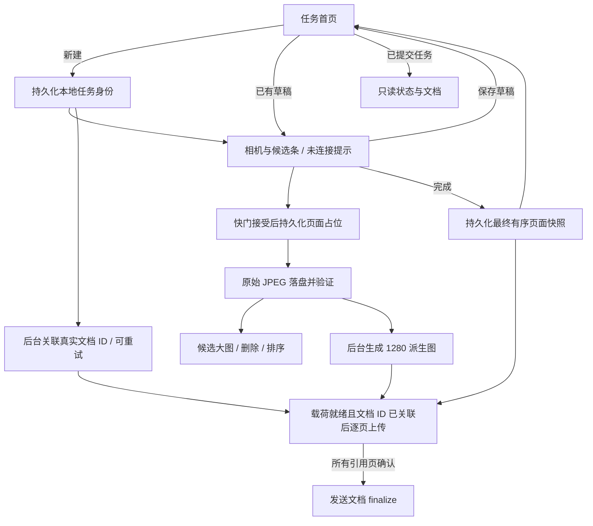
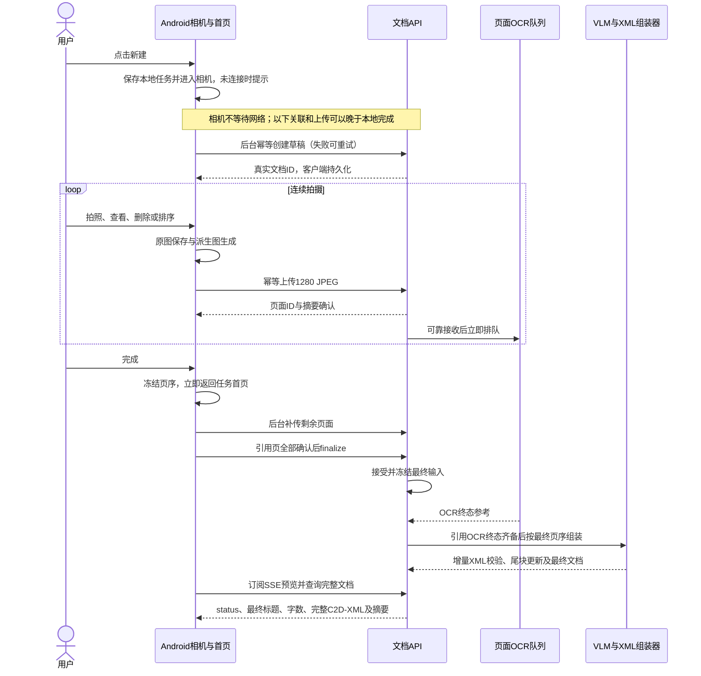

# 扫描 Pipeline：从拍照到逐页 OCR 与文档组装

> 后端首版更新：HTTP 上传/OCR 队列、完整文档 GET、Bearer 鉴权与 SSE 已实现；服务端协议以 [后端与逐块预览](server_service.md) 为准，OCR 等待终态、完成不设复核门槛。以下客户端交互及历史提案不代表 Android 已完成新协议适配。

> 最近修订：2026-09-05，任务首页迁移。
> 状态：Android 首页、多任务持久化、HTTP 客户端与 WorkManager 调度已实现；后端 API/SSE 已部署并完成公网验收，Android 尚待适配，2026-09-05 用户确认当前离线拍摄版本真机测试通过；跨端联调未完成。
> 产品交互见 [任务首页](android_task_home.md)，接口见 [Android 发起的 v1 协议提案](android_task_protocol.md)。模型与公开 XML 契约不因首页变更而修改。

## 1. 这次改变了什么

首页现在是文档任务列表，不是对话消息流或单个扫描按钮。允许多个草稿，只有一个正在使用的相机；当前版本允许先离线拍摄并持续提示未连接，服务端文档 ID 改为后台关联。相机直接管理候选，保留查看、删除、排序，移除重拍和独立整理网格。

每页 1280 派生图就绪、且真实服务端文档 ID 已关联后即可逐页上传；离线期间只保留本地待同步事实。用户点击完成时，本地冻结最终页面集合与顺序并立即回首页；后台继续补传，全部引用页上传确认后再发送会话级 finalize。首页按实际状态展示上传、处理、完成或失败，不能把返回首页等同于文档生成成功。

旧版本 `e55c8f8` 的单草稿、重拍占位和“完成进入网格”是已经被替代的本地实现，历史理由见 [设计演变](android_progress_and_plan.md#设计演变与被替代的方案)。重拍的内容替换协议不再是首版需求，但页面上传重试仍必须幂等。

本次真机通过记录来自用户部署后反馈“可以测试通过”，按当前离线拍摄版本的人工冒烟验收记录；不代表 connectedDebugAndroidTest、长时间后台/进程恢复专项或服务端 OCR/VLM 链路通过。详细证据范围见 [本轮任务首页回归](android_camera_testing.md#本轮任务首页回归)。

服务端本地 CLI 已连接 Paddle → Qwen 串行推理、完整提示词、真实 token 预算、XML 组装与原子检查点恢复。现已完成五轮有序八图实测，并冻结 [CLI 首版基线](server_pipeline_baseline_v0_1.md)：第五轮 57 块中 56 ok、1 局部 OCR 兜底，仍有内容和样式质量欠账。完成恢复与旧 V1 SIGTERM 测试分别记录，不能等同于 Android HTTP 联通。操作见 [服务端 Pipeline](server_pipeline.md)，证据见 [五轮报告](server_pipeline_evaluation_20260905.md)。

服务端实体仅 document_id、不可变 image_id 和 ordered_image_ids。Android 本轮移除重拍后每张新照片有独立 pageId，在 HTTP 边界映射为 image_id；pageIds 映射最终 ordered_image_ids。同 ID 不同摘要拒绝，不增加逻辑页面修订。CLI 从输入清单导入并冻结列表，不是实时上传服务；HTTP 路由和 SSE 以最新服务协议为准。

## 2. 当前客户端流程

新建请求的本地幂等身份在调用前落盘，不以它冒充服务端文档 ID。服务地址留空或暂时不可达时仍可新建、续拍、保存和完成，并显示未连接；正式运行不注入 Preview 示例。文档 ID 确认前不上传，任务和最终快照均保留本地，待服务配置并可达后继续后台工作。

快门门禁通过后预写 `CAPTURING`，新增页面追加到末尾；页面数组是唯一采集页序。图像目录按任务隔离，JSON 使用平台 org.json 与 AtomicFile。任务索引保存文档 ID、端点、上传确认、冻结快照、结果和隐藏标记。SavedStateHandle 只保存导航等轻量状态。

### 预览、保存与派生图是三个事件

| 事件 | 含义 | 不代表什么 |
|---|---|---|
| 候选占位/postview 可见 | 拍摄即时反馈，postview 只在内存 | 原图已完整写入 |
| 原图安全落盘 | 原图通过受限尺寸真实像素解码 | 派生图、上传或 OCR 完成 |
| 派生图可用 | EXIF 已旋正，长边不超过 1280 的压缩 JPEG | 服务端收到图片或识别出文字 |

候选优先 postview，再回退原图和派生图。上传只读取派生图，不读取原图或 postview。生成名为 OCR 派生图的文件不是执行 OCR。

相机完成仍要求至少一页，所有保留页面有安全原图；NORMALIZING 和有安全原图的 FAILED 可完成，本地异常会在任务中显式显示，不能伪报联网成功。真实快门未落盘或原图损坏时阻止完成。提交保存期间禁止继续新增、删除、排序，避免快照与输入变化竞态。

### 返回、隐藏与恢复

相机大图返回相机；相机返回提供保存、仅本机移除、继续拍摄，原图仍在保存时禁止退出。首页草稿可续拍，提交后的任务只读。空草稿保留身份和保存能力，但不能提交空文档。

相机候选双击删除会移除页面引用并删除该页本地目录；首页任务删除仅写 hidden 标记，既不取消远端任务，也不取消后台上传，更不删除所需图片。隐藏任务在进程重建后仍被后台同步，但不重新出现于列表。

冷启动恢复原图/派生图，不重放真实快门。有效原图可重建损坏派生图；缺失原图保留原位置失败占位。旧 RETAKE_REQUIRED 迁移为失败页，不恢复重拍入口。任务清单损坏时保留原文件并显示错误，不清空整个任务集合。详见 [草稿恢复](android_scan_draft.md)。

## 3. 跨端流程与触发条件

下述客户端已实现请求适配器；服务端接收、业务队列与任务 API 仍待按提案实现。独立模型 Worker 并不等于跨端链路已运行。

### 阶段职责与完成条件

| 阶段 | 触发条件与产物 | 负责方 |
|---|---|---|
| 创建 | 本地持久化任务即可拍摄，后台关联真实文档 ID 后才上传 | Android 客户端 / 服务端 API |
| 上传 | 派生图就绪；页面 ID + SHA-256 确认 | Android WorkManager / 服务端 API |
| OCR | 服务端可靠接收后排队；绑定页面及内容摘要 | SQLite 持久化队列 / 独立 Worker |
| 最终提交 | 本地快照先保存；全部引用页确认后发请求 | Android / 服务端 API |
| 文档组装 | 服务端接受最终集合，所需 OCR 任务进入终态 | 独立 worker / VLM |
| XML 与输出 | 校验、尾块更新、序列化；再由目标 Renderer 输出 | 已有 XML 模块 / 未实现 Renderer |

### 最终页序与三个“完成”

| 动作 | 职责 |
|---|---|
| 相机“完成” | 本地检查安全原图，冻结有序引用，返回首页 |
| 会话级 HTTP finalize | 服务端接受最终页面集合与顺序，安排等 OCR 齐备后的文档处理 |
| C2DAssembler.finalize() | 校验内存 XML 并返回 UTF-8 字节；不冻结会话、不启动 OCR/VLM |

VLM 恢复用户确认顺序中的跨页段落、列表、表格和层级，不擅自重排采集页面。未来 Renderer 输出 Lark/Markdown/思源，当前客户端只读 plainText 是联调展示，不替代 XML 输出契约。

## 4. 交错操作示例

### A、B、C 的顺序与删除

依次拍摄 A、B、C，OCR 按 B、A、C 返回。用户删除 B、将 C 移到 A 前，最终快照为 C、A。客户端等待 C、A 上传确认后提交，服务端只等 C、A 的有效结果，再按 C、A 组装。B 的孤立资产不参与最终文档，其回收期限待服务端设计。上传重试复用页面 ID 和摘要，不重复排 OCR。

重拍已移除。用户需要替换照片时删除旧候选并新增一页，新页面拥有新 ID，再自行排序。旧版“同 ID 替换内容”仅作为迁移背景保留，不进入 v1 接口。

### 点击完成时仍有未完成任务

| 情况 | 客户端处理与边界 |
|---|---|
| 原图未安全落盘 | 禁止完成 |
| 原图安全、派生图未就绪 | 保存快照回首页，后台等待派生图 |
| 无服务地址、未关联文档 ID 或临时断网 | 本地冻结页序并回首页，提示未连接；配置且可达后再关联、补传 |
| 图片存在但上传失败 | 保留本地文件；连接问题单独显示未连接，协议或文件阻断错误显示失败 |
| 部分仍在上传，其他页 OCR 中 | 首页蓝色上传优先；不丢弃未上传页 |
| 上传齐备、OCR 未结束 | 发送最终提交，黄色处理中；VLM 必须等待 |
| 所需页 OCR 失败 | 红色失败，不静默跳页；服务端重识别操作尚未实现 |
| XML 更新失败 | 组装器不提交错误更新；模型重试由后续调度负责 |

XML apply_update 的重复应用不是幂等操作，不能将页面 PUT 重试逻辑直接套在组装更新上。本地 CLI 已用原子轮次日志、输入游标和哈希绑定恢复已提交结果，模型请求可能重试但提交日志不重复应用。流式 block 的事件去重、revision、尾块修订与断线续传仍需要联调。

## 5. 数据、生命周期与资源边界

本地页面状态、上传确认、OCR 状态、文档状态分别持久化，不混成 READY。任务级草稿标签与执行阶段独立。只有最终提交已确认且服务端 COMPLETED 才展示最终字数与文档成功。网络异常不表示本地照片损坏。

每个任务首次记录的非空服务地址保持不变，不能因构建配置改变而向另一服务补传旧图片；离线创建且地址为空的任务可在后续配置、重开 App 时首次绑定。WorkManager 使用 CONNECTED 网络约束、独立任务链及指数退避；系统可延迟执行，后台状态不承诺实时。冷启动重新载入上传确认、最终快照和隐藏标记，重试同一请求身份。真实断网、进程死亡、系统调度及服务端协同仍待设备联调验证。

页面 ID、采集顺序、来源路径、内容摘要均为内部元数据，不加入公开 C2D-XML。模型配置沿用已合并模型文档：PaddleOCR-VL-1.6 完整页面 pipeline 是目标，当前 Worker 的 recognize_image 仅 OCR:；NVIDIA 16GB 默认 Qwen3.5-9B FP8，Apple Silicon 16GB 默认 4B 4-bit。立即入队不承诺双模型常驻或并行推理。本地 CLI 已实现 Paddle → Qwen 顺序装卸、进程及显存清理门禁；实时上传、OCR 等待和最早 finalize 优先调度已由服务层实现。

## 6. 联调前必须完成的决策

后端接口已确定并部署，Android 待按 [服务协议](server_service.md) 适配。下面列出下一轮联调边界，不把旧客户端提案当成当前后端响应。

| 主题 | 已实现的服务端行为 | Android 下一步 |
|---|---|---|
| 上传 | JPEG ≤10 MiB、长边≤1280，ID/摘要幂等与冲突检查 | 确认实际派生 JPEG 字节，记录上传耗时和断流重试 |
| 鉴权 | 个人多设备 Bearer，摘要存储与撤销，HTTPS | 接入设备令牌和安全保存；未配置时保持离线采集 |
| 提交 | pageIds 冻结，OCR 终态门禁，确认顺序组装 | 持久化最终顺序，补传后幂等 finalize |
| 最终结果 | status、完整 c2dXml、UTF-8 摘要，needsReview=false | 替换旧 flag/plainText 查询模型，校验摘要并采用最终 XML |
| 流式 | 持久化 SSE、稳定 blockId/version、原子 patch 和 Last-Event-ID | 原子保存预览/游标，支持插入、替换、撤回和快照重建 |
| 恢复 | outbox 去重、检查点预算继承、GPU 清理门禁 | 真机网络、进程及后台调度联调 |
| 保存与移除 | 数据保留、配额、手动清理；断开 SSE 不取消任务 | 继续区分本地隐藏与服务器执行 |
| 渲染 | 服务端提供合法 XML；局部兜底不阻止完成 | 同一渲染层消费单块预览和最终 XML，不增加复核门槛 |
