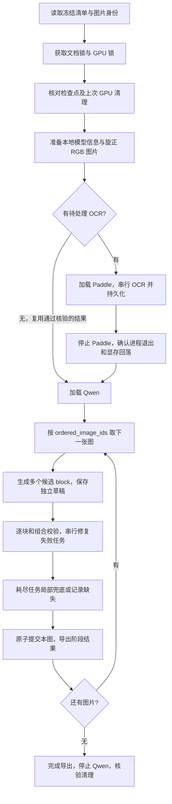

# 文档转换 Pipeline 首版基线 v0.1.0

> 冻结日期：2026-09-05。基线标签：`pipeline-cli-v0.1.0`。采用第五轮八图测试的实现 `7c7fe7c4fa8b22d949694b37cf3d4040763d54f2`；本次仅整理文档及基线清单，不改变运行行为。
>
> 定位：可恢复、失败局部隔离的本地 CLI 原型。已完成真实八图处理；内容、样式和跨图重复仍需复核，尚不是 Android 联通或排版质量验收版本。

## 1. 从哪里读起

| 资料 | 负责回答的问题 |
|---|---|
| 本文 | 当前版本到底做了什么、顺序是什么、冻结哪些边界 |
| [CLI 操作与协议](server_pipeline.md) | 如何准备清单、运行、恢复、读取结果，修复和兜底细节 |
| [五轮实测报告](server_pipeline_evaluation_20260905.md) | 每轮改动、真实结果、失败证据和评价限制 |
| [机器可读基线清单](../server/baselines/pipeline_cli_v0_1.json) | 源码、资源及结果哈希，实际配置与证据位置 |
| [C2D-XML 格式](c2d_xml.md) | 公开标签、结构和样式规则 |
| [跨端目标时序](capture_pipeline.md)、[协议提案](android_task_protocol.md) | 后续 Android 接入需要遵守什么；不代表已有服务端 API |

版本号分别有不同含义：本次产品基线为 `pipeline-cli-v0.1.0`，运行和检查点协议为 V2 / `schema_version=2`，公开 C2D-XML 为 v0.1，Python 包当前为 0.1.0。它们不互相替代。旧 V1 检查点仍有兼容恢复入口，但不属于本次新建文档流程。

## 2. 冻结范围与实现边界

冻结 CLI 输入、顺序、模型配置、提示词资源、JSON 输出、草稿事务、修复预算、兜底和恢复行为。Git 标签提供可回到的版本；清单是审计记录，CLI 不会自动读取它来覆盖配置或阻止后续开发。

| 已有能力 | 本基线边界 |
|---|---|
| `document_id` + 不可变 `image_id` + 最终有序列表 | 一次 CLI 接收已冻结清单；没有实时接收图片的 HTTP 服务 |
| 整图 Paddle `OCR:` 请求 | 返回整图文本；未接入布局检测、区域框、区域任务路由 |
| Qwen 图文生成多个语义块 | 一张图是一批输入，不是一个 block；段落、标题、列表、表格、代码等分别组织 |
| 单 GPU、单请求、模型轮换 | 先完成本次所需 OCR，再卸载 Paddle、加载 Qwen；不是每张图切换模型 |
| 局部修复与兜底 | 坏块不阻塞后续图片；基础设施错误仍停止 |
| 文档 JSON、XML、逐块报告 | Lark、Markdown、思源 Renderer 与发布不在本基线内 |

不启用扩展样式 few-shot 和跨图重叠生成实验；保留基础样式规则、最近历史、只读历史工具及旧尾块续接。禁用实验不意味着已经解决跨图重复。GPU 使用固定 KV cache，未改为 0.95 利用率，也未增加并发实例。

## 3. 一份文档如何运行



1. 清单包含 `document_id`、可选 `lang`、`images` 与 `ordered_image_ids`。图片路径相对于清单目录；最终列表必须非空、无重复且全部能找到图片。未被选择的图片不执行 OCR。
2. 原始图片复制入文档目录并校验 SHA-256；EXIF 旋正后转 RGB PNG，保存实际尺寸与模型图片摘要。此步骤不做二次缩小；两个模型各自在处理器中应用自己的像素预算。
3. 模型必须已经缓存，CLI 不隐式下载。新实验可以导入旧目录的成功 OCR，但必须同时匹配原图、准备后图片、Paddle 配置、快照元数据指纹和原始响应身份。更换图片字节后不能继续使用旧 OCR。
4. 待执行 OCR 按单请求处理；保存原始响应、文本、完成标记、token 和耗时。非空不等于完整：空结果和 `finish_reason=length` 明确记录不完整。图片仍可交给 Qwen，但不能把截断 OCR 宣称为全页文字。
5. Qwen 按确认顺序完成每张图的主生成、修复、兜底和提交，再处理下一张。在整个阶段内维持一个模型实例。
6. 已完成检查点恢复只检查已有状态和清理证据并重建导出，不新增模型请求。未完成恢复会核对运行契约；不允许换提示词或配置继续消耗旧草稿。

Paddle 请求是 user 消息中的图片加 `OCR:`，没有额外 C2D system prompt。客户端封装返回 `OcrResult(content, raw_response)`；原始响应保留 `choices`、`finish_reason`、`usage` 等推理服务字段。瞬时 OCR 请求错误最多尝试三次，中断也计数；收到空或截断响应后直接记录不完整，不以重试扩大 4K 输出上限。这个预算与 Qwen 五次局部修复相互独立。

OCR 导入目前比较整个 Paddle 配置对象，包含主机和缓存路径；跨机器路径改变可能被拒绝，不能只核对模型名。另一个未补强的边界是：导入路径检查 `stop` 和原始响应一致性后设置 `complete=true`，未再次检查空字符串；八图实测导入均为非空，但任意外部 `stop` 空结果不能据此认为已验证完整。这些是冻结实现的边界，本次不修改算法。

未来上传业务的“立即 OCR”意为立即入队；Qwen 占用 GPU 时新图片可以由未来接收层保存并等待。当前 CLI 没有这个跨文档接收/排队层，也不执行 Android 的 finalize HTTP 请求。

## 4. 身份、正文与追溯数据

| 对象 | 定位与职责 |
|---|---|
| 文档 | `document_id`，持有最终 `ordered_image_ids` 与检查点 |
| 图片 | 不可变 `image_id`，绑定原始图片、模型图片和 OCR；本流程不增加服务端 page 实体 |
| OCR 来源 | `image_id:ocr:原始行号`，携带原文本的字符区间；不是语义分块或位置框 |
| 内部 block | 稳定 ID、版本、来源引用、修复祖先与预算；用于事务定位 |
| 输出 block | 在导出 `doc.blocks[]` 时编号 `block_id=0..N-1`；不是运行中修改目标的稳定身份 |
| 批次/草稿/尝试 | 一张图一批；草稿保留原候选，尝试保存请求、响应、目标版本和错误 |

公开 C2D-XML 只保存逻辑内容及顺序，不写图片 ID、坐标、来源、处理状态或错误。`document.json` 的公开 block 字段为 `block_id/status/vlm_validation/final_validation/text/xml/fallback_source/errors/repair_attempts`；完整来源和内部版本在检查点与草稿中，不能假设公开 JSON 已包含所有调试字段。

## 5. 主生成与上下文

图片决定文档有效文字、阅读顺序和样式，OCR 提供识别参考。要求保留有效内容，不总结、不按主题删段；只过滤明确属于环境的文字。粗体、文字色和背景色依据图片映射为 C2D 允许的样式。

每次主请求提供完整 C2D 规则、经校验的基础结构/样式例子、当前图、带来源 ID 的 OCR，以及最近 1–3 个完整历史块。模型为每块单独返回 `xml`、`text` 和 `ocr_refs`，避免 XML 损坏时没有独立文字可用。

历史读取使用应用层 JSON action：`read_blocks` / `search_blocks` 返回至多三个完整块，每个任务至多三次读取，之后 `submit`。这不是 vLLM 原生 function-calling parser。更早历史只读；主生成只能提出旧尾块的完整替换和本图新增块。

每个请求都用实际 Qwen processor/tokenizer 预检完整输入，包含图片、system、JSON 与工具结果：

```text
允许输出 = min(8192, 16384 - 实际输入 tokens - 512)
```

预算不足先减少可选完整历史块，不截断图片、OCR、目标 XML 或旧尾块；不足以容纳至少 512 输出 tokens 时进入局部失败处理。V2 不沿用独立 `C2DAssembler` 的 768/1536 token 历史策略。16K 上下文并不承诺任意长度的表格、代码或尾块都能生成。

提示词通过 UTF-8 TXT、Git 和包资源管理：任务协议 `c2d_blocks_v2.txt`、格式规则 `c2d_contract_v2.txt`；基础动态示例在 `blocks.py`。`c2d_style_examples_v2.json` 与 `c2d_overlap_experiment_v2.txt` 是保留但默认不追加的实验资源。检查点绑定提示词、示例、响应 schema 与模型配置摘要。

## 6. 校验、修复和提交

草稿先进行安全 XML 解析、XSD、语义和单 block 根节点检查，再检查与已有正文组合后的约束。语法通过不证明图片转录正确；OCR 字符对齐只作诊断，不是逐字覆盖的修复门槛。

正确块保留。独立错误分别排队，共同约束涉及的连续块组成任务；一个 Qwen 串行处理。初次生成后每个块或关联组最多五次修复，拆分、合并与恢复沿用祖先预算。多个失败任务合计调用数可以超过五次；中断尝试也占预算。

修复上下文增加目标完整 XML、独立文字、图与 OCR、邻居、允许修改范围、当前错误和必须保持的既有约束。错误尽可能包含 code、目标、行列/XPath、实际/允许结构、修复说明和已验证示例。

每次应用都检查尝试 ID、目标版本、连续范围和内容守恒。过期、重复、越界，以及复制邻居、丢字或改动代码空白的结果会被拒绝。局部拆分/合并只改变当前允许范围，不按任务完成时间重排正文。

第五轮有一类窄结构安全选项：无属性、无额外正文的 `blockquote` 仅包住一个 `pre`。程序预先验证可保持文字和代码空白的选项，模型只选择接受或拒绝，应用时重新核验当前对象。这不是通用 XML 自动纠错；多顶层根错误仍可能耗尽五次预算。

所有任务变成成功、兜底或缺失后，正式块、批次游标和草稿清理写入同一原子 `state.json`，然后进入下一张图。不会向正式文档逐次写入尚未通过检查的修复中间态。

## 7. OCR 如何对应 block，以及兜底的真实保证

Paddle 当前返回整图字符串。服务端用 `splitlines(keepends=True)` 为每个非空行分配来源，保留换行和原文字符偏移；行号从 0 开始，空行会使来源 ID 不连续。它不按自然段、坐标或 Qwen 的 block 自动切分。

例如原 OCR 为 `标题\n第一行\n第二行\n`，服务端分配三个来源：

```json
[
  {"source_id": "image-1:ocr:0", "start": 0, "end": 3, "text": "标题\n"},
  {"source_id": "image-1:ocr:1", "start": 3, "end": 7, "text": "第一行\n"},
  {"source_id": "image-1:ocr:2", "start": 7, "end": 11, "text": "第二行\n"}
]
```

Qwen 可以把后两行组织为一个段落，并返回 `ocr_refs=["image-1:ocr:1", "image-1:ocr:2"]`。**对应关系由模型提出；服务端当前没有独立语义对齐来证明它正确。** 一个存在、唯一但指错的引用仍可能通过来源检查。

失败任务耗尽修复预算后，程序依次处理：

1. 有非空引用，且每个引用都存在于当前图片来源中、在所有候选中只被引用一次、未被已提交块占用：按服务端原 OCR 顺序拼接对应行，不采用模型重新写出的 OCR。
2. 引用未知、共享、缺失或被占用：改用独立保存的该块 `text`，标记 `fallback_source=vlm_text`。
3. 没有可用合法文字：保留该位置的 `unresolved`，`text/xml=null`，继续后续任务。

共享来源不会由“先完成的块”抢占：若一条粗粒度 OCR 行被两个候选引用，两者都不能凭它执行 OCR 兜底。一个 block 可引用多行；一行也可能包含多个语义块的内容，因此来源粒度仍是当前限制。

兜底通过 XML 库构造普通 `p`，换行变 `br`，重新校验；不用剥除损坏 XML 标签取文字。所有兜底都待复核，保留原失败状态和候选。只有整张图没有完整候选列表时，允许整图 OCR 降级一次，不能为每个坏块各复制一份整图 OCR。旧尾块失败恢复原尾，仅降级可区分的当前图新增文字；分不清则记录缺失。

当前程序选定 OCR 或 VLM text 后，如果文字无法构造合法 XML（例如包含不允许的控制字符），直接记录 unresolved；不会在这个分支再改试另一来源。这也是尚未补强的边界，不应把兜底解释为所有原始字符串都能自动修复。

真实 R5 的 Block 23 使用 image-4 的 OCR 15–20 六行，原字符区间 287–561，与邻居引用没有冲突。它说明局部来源兜底路径实际运行过，不证明这些 OCR 字符都识别正确；原 OCR 错字也被保留。

## 8. 输出、恢复和运维

主要结果 `document.json` 的 `doc.blocks[]` 决定顺序。`processing_status=completed` 只表示最终列表处理完；`status=ok` 只表示候选通过检查，`fallback` 表示降级，`unresolved` 保留缺失位置。`vlm_validation` 与 `final_validation` 分别记录模型候选和最终采用内容的校验，不能用兜底成功抹去模型失败。

`needs_review` 表示待复核，`semantic_fidelity_verified` 当前始终为 false。无缺失时可输出 `document.c2d.xml`；处理期间或存在缺失时输出 `document.partial.c2d.xml`；没有可用合法块则 XML 不可用。`xml_status=complete` 不表示内容完整性已经得到视觉验证。

`needs_review` 当前在存在降级/缺失、OCR 不完整、逐批 OCR coverage 或 output support 小于 0.8，以及重叠实验待复核证据时置为 true。这是程序提示复核的条件，不是视觉验收器；false 也不保证没有错字或漏样式。修复成功后的原错误仍保留，但不会仅因保留了历史错误就自动判为 fallback。

操作命令、退出码和完整目录树见 [CLI 操作指南](server_pipeline.md)。`blocks.md` 从 Block 0 展示每块完整文字、XML、修复次数、兜底来源和错误；`summary.json` 提供逐图诊断。完整归档应保留整个结果目录，只有四份导出文件不足以恢复运行。

| 情况 | 当前处理及操作边界 |
|---|---|
| 坏块五次耗尽 | 局部兜底或缺失，自动继续，不使用 `--retry-failed` 重置 V2 预算 |
| Qwen 输出截断/无完整候选 | 记录原响应并降级；不补闭合标签伪装成功 |
| 普通中断 | 保留检查点，正常终止路径清理模型后 `--resume`；已收到响应可重放，未收到的尝试占预算 |
| 完成后 resume | 不再推理，恢复导出；待复核结果仍退出 3 |
| 输入、提示词或运行配置改变 | 新建独立输出目录；只按严格身份条件导入 OCR |
| 检查点/导出被外部修改、身份冲突 | 停止并检查原始证据，不直接手改状态或覆盖输出 |
| GPU 清理未通过 | 阻止下一模型加载；确认旧进程归属并完成清理后才恢复 |

文档目录锁避免双写，协作 CLI 共用 GPU 文件锁；手动启动的 Worker 不受这个文件锁约束。停止模型后核验进程组和显存，基线容差为 128 MiB。SIGKILL/断电后的资源托管仍需操作系统保障，不能把 SIGTERM 实测外推到所有故障。

## 9. 冻结的运行配置

| 配置 | Paddle | Qwen |
|---|---:|---:|
| 模型 | PaddleOCR-VL-1.6 | Qwen3.5-9B |
| 权重 / 推理 | BF16 / BF16 | BF16 快照 / fp8_per_channel 在线量化 |
| context / 最大输出 tokens | 8192 / 4096 | 16384 / 8192 |
| max_pixels | 1003520 | 1310720 |
| KV cache | 256 MiB | 640 MiB |
| max_num_seqs / 每请求图片数 | 1 / 1 | 1 / 1 |
| max_num_batched_tokens | 4096 | 4096 |
| temperature | 0 | 0 |
| thinking | 不适用 | false |
| 端口 | 8118 | 8119 |

CLI 默认主机为 `127.0.0.1`，原 WSL 实测使用 `--host 10.255.255.254`。Qwen 独立 Worker 的默认 1 GiB KV 和其他压力测试上下文长度不属于 CLI 基线。请求超时 1200 秒，SDK 隐式重试为 0。

完整实际设置和资源摘要见基线清单。`revision=master` 是模型缓存选择名，不是不可变上游提交；记录的快照指纹基于元数据/配置，并非所有权重文件的完整内容哈希。要重现实测，应保留实际缓存和运行证据，不能把重新下载今天的 master 当作完全相同权重。温度为 0 也不保证跨环境逐字输出一致。

## 10. 已验证结果与质量欠账

第五轮八图按 image-1 → image-8 全部处理完成：57 块，56 ok、1 OCR fallback、0 unresolved；8 次生成和 5 次自然修复全部正常 stop。耗时 687.56 秒包含 Qwen 加载和清理，使用已验证的旧 OCR，不包含首次 OCR 耗时。

Block 23 的多顶层根错误五次修复均因改变目标内容而被拒绝，局部兜底后继续处理剩余图片；独立 `blockquote/pre` 故障注入一次选择修复通过，四个正确邻居不变。二者是不同测试，不能混为“所有修复一次成功”。完成后恢复约 0.16 秒，无新增推理，导出哈希不变。

代码提交 `7c7fe7c` 的记录为全量 393 项测试通过，wheel 构建与提示词/XSD 资源隔离加载通过。本次文档冻结不新增 GPU 实验；具体历史证据和五轮表格见 [实测报告](server_pipeline_evaluation_20260905.md)。

当前固定抽样为 21/49：内容 15/20、标题及粗体 6/21、背景高亮 0/6、蓝字 0/2。这不是全文准确率。仍存在数字/运算符错误、代码缩进损失、编辑器文字混入、正文粗体和颜色遗漏、跨图重复，以及 OCR 来源语义对应未验证等问题。

五轮实际静态输入均为 800×600，不能按大文件体积或 EXIF 声明当作 4000×3000。已提取的 1440×1080 视频帧仅用于另行诊断，没有替换八图输入。更清晰输入的完整链路对照仍未执行。

原始照片、完整文字和运行产物保留在 ignored 的 `server/.cache/`，不提交 Git。基线清单记录相对证据位置和 SHA；新 clone 只有代码和摘要，不自动获得原图、模型或检查点。

重现版本时可从已有仓库建立独立工作目录，避免改变当前开发分支：

```bash
git fetch origin tag pipeline-cli-v0.1.0
git worktree add --detach ../capture2doc-baseline pipeline-cli-v0.1.0
cd ../capture2doc-baseline/server
uv sync --locked --extra cuda
```

随后按照 [CLI 操作指南](server_pipeline.md) 准备本地模型、输入清单及全新输出目录。`--output-dir` 指向实际结果根目录；历史实验约定使用 `<实验名>/result`，CLI 不会自行再加一个 `result/`。迁移恢复须带完整结果目录并保持其运行契约，不能只复制 XML。

## 11. 后续如何推进

当前先保留这份能运行、能恢复、能看清失败的基线。下列是下一步讨论依据，本次不执行：

| 优先方向 | 已有证据 | 下一步可验收的最小结果 |
|---|---|---|
| 输入与内容真值 | 实际 800×600；数字、运算符、缩进误识别 | 独立高清清单及新 OCR，对照相同八图，增加逐字/代码真值 |
| 来源关联可信度 | 唯一且存在的错误引用仍可能通过 | 用指错、共享、粗行样本定义何时可用 OCR；不降低现有防重复约束 |
| 多根结构修复 | R5 Block 23 五次耗尽 | 在独立文字可证明一致时提供安全拆分，回放原草稿并确认邻居不变 |
| Android 服务端接入 | 客户端有适配器，服务端 HTTP 尚缺 | 评审最小协议并接入同一业务层，实测上传身份、最终顺序和后台恢复 |
| 样式与拼接 | 样式缺失、重叠实验导致截断 | 独立实验目录，一次只改变一个因素，统计误加样式及误删内容 |

建议下一次先确定是优先让手机端完整联通，还是先建立输入与内容的可信评价；两者均继续以本标签为对照，不直接覆盖它的检查点和八图产物。

## 12. 源码导航与后续变更规则

| 文件 | 责任 |
|---|---|
| [run_document.py](../server/scripts/run_document.py) | CLI 参数、V1/V2 路由、锁、退出码 |
| [document.py](../server/src/capture2doc/pipeline/document.py) | V2 检查点、请求循环、预算、批次提交和导出 |
| [models.py](../server/src/capture2doc/pipeline/models.py) | 本地快照、图片预处理、模型阶段和 GPU 清理 |
| [blocks.py](../server/src/capture2doc/pipeline/blocks.py) | 候选校验、错误示例、OCR 分段、兜底、公开 block |
| [draft.py](../server/src/capture2doc/pipeline/draft.py) | 草稿任务、版本、预算、内容守恒与尾块保护 |
| [protocol.py](../server/src/capture2doc/pipeline/protocol.py) | 外层 JSON action schema |
| [repair_options.py](../server/src/capture2doc/pipeline/repair_options.py) | 预验证结构选项和应用检查 |
| [overlap.py](../server/src/capture2doc/pipeline/overlap.py) | 默认关闭的重叠实验 |
| [evaluation.py](../server/src/capture2doc/pipeline/evaluation.py) | 运行证据与固定样本评价 |

后续改动使用新提交和独立结果目录，保留本标签及全部失败基线。提示词、schema、模型配置或算法变更均需记录；只在身份一致时复用 OCR。比较时分别报告处理完成率、语法通过、修复/兜底、内容与样式，不能以其中一项替代其他项。需要发布新的基线时创建新标签，不移动 `pipeline-cli-v0.1.0`。

本次冻结检查：源码、脚本、测试及依赖文件与 R5 一致；默认提示、动态示例和 action schema 摘要与 R5 检查点一致；7 份包资源、20 份结果导出及 5 份评价报告的哈希吻合。重新检查五轮共 273 个输出 block 的 JSON 往返和五份 XML 合法性通过，文档 JSON 示例与实际 OCR 分段一致，91 个相对文件链接存在，Markdown 代码围栏与 Git 空白检查通过。393 项测试及 GPU 耗时仍引用原 R5 记录，本次没有重跑模型。
